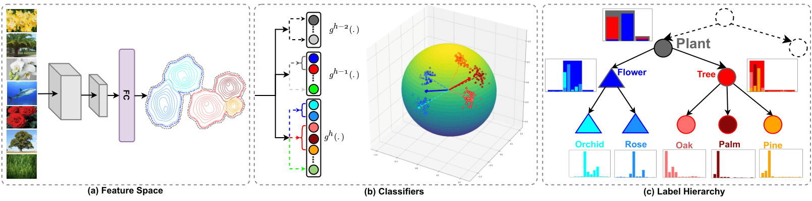

# HAF in PyTorch

Official Code Release for **[Learning Hierarchy Aware Features for Reducing Mistake Severity](http://arxiv.org/abs/2207.12646)** <br/>
Ashima Garg, Depanshu Sani, Saket Anand. <br />

_European Conference on Computer Vision (ECCV 2022)_

## Citations
If you find this paper useful, please cite our paper: 
```
@inproceedings{garg2022learning,
  title={Learning Hierarchy Aware Features for Reducing Mistake Severity},
  author={Garg, Ashima and Sani, Depanshu and Anand, Saket},
  booktitle={European Conference on Computer Vision},
  pages={252--267},
  year={2022},
  organization={Springer}
}
```

## Proposed Approach 
<div align="center">
  
</div>


## Installation
Clone this repository
```
$ git clone https://github.com/07Agarg/HAF.git
$ cd HAF
```

## Dataset Preparation
Refer to Repository: [Making Better Mistakes](https://github.com/fiveai/making-better-mistakes) 

## Hierarchies 
Refer to Repository: [Making Better Mistakes](https://github.com/fiveai/making-better-mistakes) 

## Using the Code for Training
The experiments in the paper are contained in the folder ```experiments/``` dataset wise. 
For CIFAR-100
```
bash experiments/train/cifar-100/cross-entropy.sh
```
For iNaturalist-19
```
bash experiments/train/inat/cross-entropy.sh
```
For tiered-imagenet
```
bash experiments/train/tieredimagenet/cross-entropy.sh
```

## For testing
Refer to the code repository: [CRM-making-better-mistakes](https://github.com/sgk98/CRM-Better-Mistakes)

## Link To Trained Models
Download HAF final trained models from the [link](https://drive.google.com/drive/folders/1-dPWyfg6QbOg6dLQ9ECB-LVzL48vWNXq?usp=sharing) and use the above repository for testing. 

## Acknowledgements
This codebase is borrowed from [making-better-mistakes](https://github.com/fiveai/making-better-mistakes)

## Contact 
If you have any suggestion or question, you can leave a message here or contact us directly at ashimag@iiitd.ac.in
